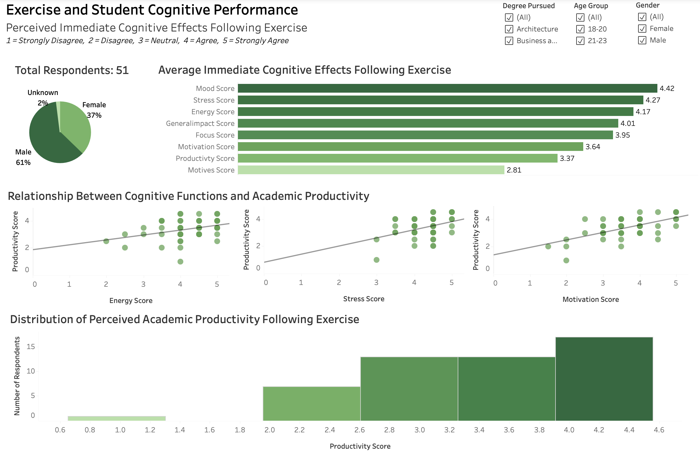
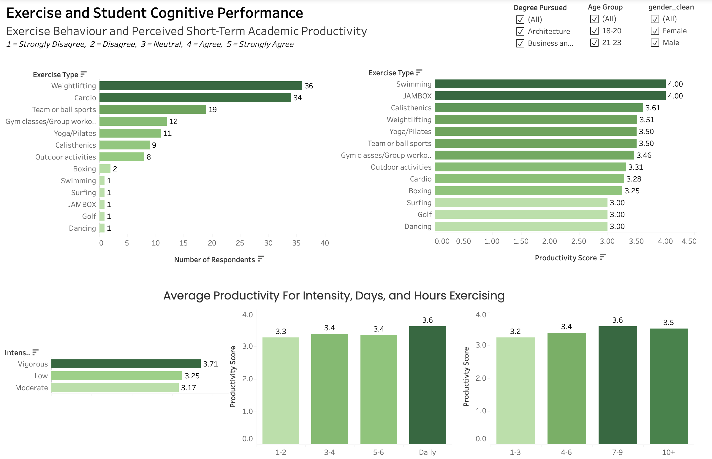

# Exercise and Student Cognitive Performance

## Project Overview
This project is derived from my dissertation and investigates whether physical exercise influences students' perceived cognitive functioning and short-term academic productivity. The purpose of this study was to better understand this relationship and provide practical recommendations for students to optimize their exercise habits in order to enhance academic performance.
The research was initially inspired by my own experiences, where I observed increased cognitive functioning, motivation, and productivity levels immediately following exercise.

## Hypothesis
The study hypothesised that exercise has an immediate positive effect on one’s cognitive
behaviour and direct ability to achieve increased academic productivity.

## Research Questions
- Does exercise frequency influence productivity?
- Do cognitive effects such as increased energy, higher motivation, or reduced stress influence productivity?
- Which exercise types are associated with higher productivity?

## Tools Used
- Google Sheets
- Tableau

## Data Collection
The dataset was collected through a survey targeting students. Respondents were presented with a series of statements regarding the cognitive effects they experience following physical exercise.

Participants evaluated each statement using a 5-point Likert scale:

1 = Strongly Disagree  
2 = Disagree  
3 = Neutral  
4 = Agree  
5 = Strongly Agree  

Statements measured perceived short-term changes in:
- energy levels
- motivation
- stress reduction
- focus
- mood
- academic productivity
- motives for exercising
- overall general impact

In addition, respondents reported their typical:
- exercise frequency
- exercise intensity
- exercise type

This quantitative survey formed part of a **mixed-methods research approach**, where quantitative results were complemented by a qualitative component exploring students' perceptions of exercise and academic performance.

## Data Preparation
Data cleaning and preparation were performed in Google Sheets before importing the dataset into Tableau.

The preparation process included:

- Cleaning and standardizing categorical variables 
- Handling missing values and replacing undefined categories with appropriate labels
- Creating midpoint variables for grouped responses including age group and exercise frequency
- Structuring the dataset into two tables (`clean_data` and `clean_exercise_type`) connected through a respondent identifier

These steps ensured that the dataset could be properly analysed and visualized in Tableau.

## Methodology
The analysis was conducted using interactive dashboards built in Tableau.

The dashboards explore:

- relationships between exercise behaviour and perceived productivity
- correlations between cognitive outcomes (energy, stress reduction, motivation) and productivity
- differences in productivity across exercise types, frequency levels, and intensity

Filters allow the analysis to be segmented by demographic variables such as gender, age group, and degree pursued.

## Dashboards

### Cognitive Effects of Exercise

### Exercise Behaviour and Productivity

## Tableau Workbook
The packaged Tableau workbook (.twbx) is included in this repository.

## Key Insights
The analysis suggests several patterns in the relationship between exercise and perceived academic productivity:

- Higher exercise frequency is generally associated with higher reported productivity levels.
- Cognitive effects such as increased energy and motivation show strong positive relationships with productivity.
- Reduced stress following exercise also appears to contribute to improved productivity.
- Certain exercise types appear to be associated with higher productivity outcomes, although results vary across respondents.

These findings suggest that physical exercise may play a meaningful role in supporting students’ perceived cognitive performance and short-term academic productivity.

## Final Results

- The majority of participants reported either neutral or positive immediate effects of physical exercise on their cognitive functioning and productivity levels.
- Swimming and JAMBOX showed the highest perceived productivity levels following exercise; however, these results were based on a single participant and should be interpreted with caution.
- Calisthenics and weightlifting demonstrated slightly lower average productivity scores, but were supported by a larger and more reliable sample size.
- Participants engaging in vigorous-intensity exercise and/or training 7–9 hours per week exhibited a slight advantage in reported productivity levels.

## Disclaimer

The wide variation in responses indicates a divided sample: participants who exercise more frequently and report positive effects on cognitive functioning also tend to perceive higher productivity levels. Therefore, it cannot be conclusively determined that all students experience an immediate increase in productivity from physical exercise.

## Recommendations

- Students who perceive improved cognitive functioning and productivity after exercise should consider aligning their training sessions with study periods or exams to maximize potential performance benefits.
- As higher frequency and vigorous-intensity exercise were associated with slightly better productivity outcomes, students may benefit from maintaining a consistent weekly routine (e.g., 7–9 hours per week) to support cognitive and academic performance.
- Given the variation in results, students should experiment with different types, intensities, and timing of exercise to identify what best enhances their own cognitive functioning and productivity.
